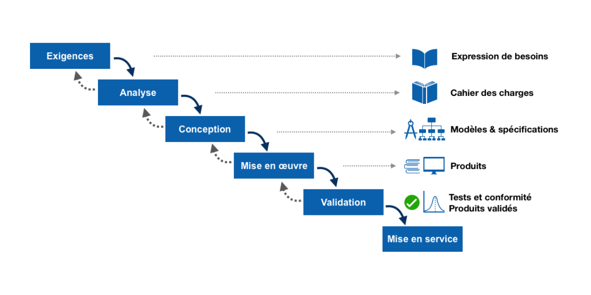
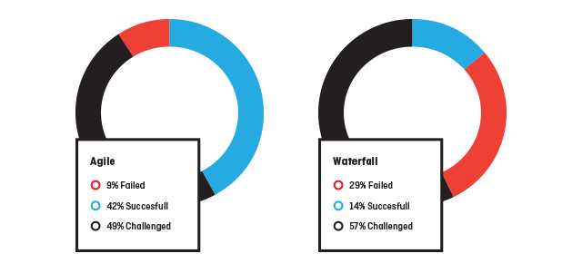
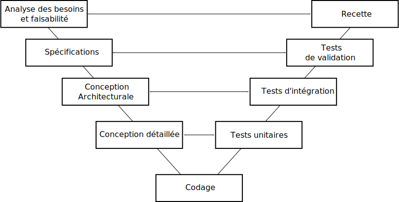
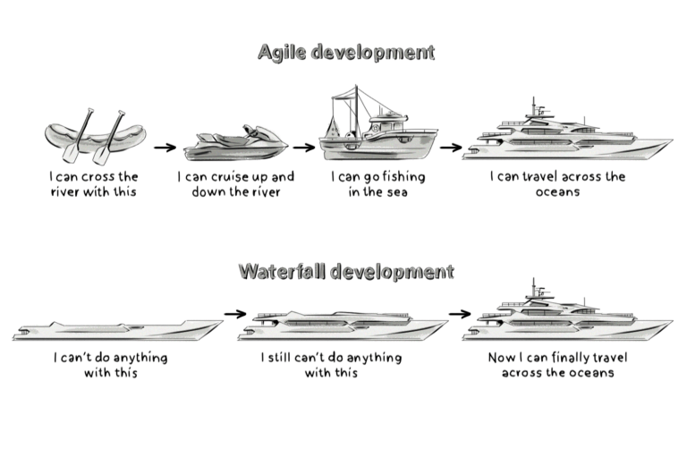
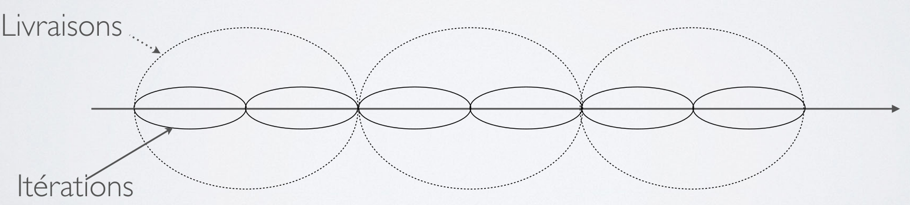
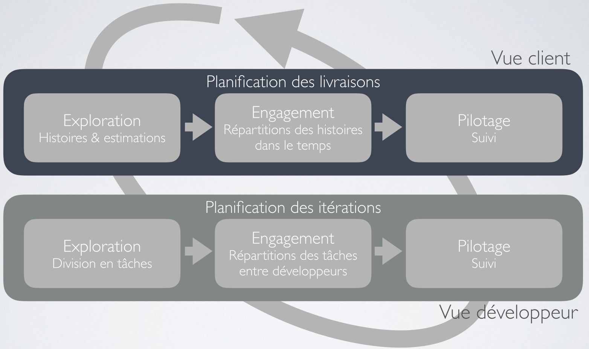
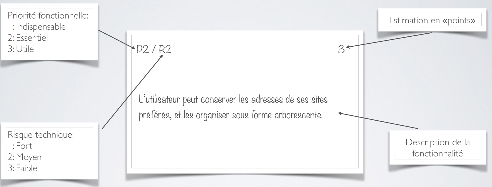
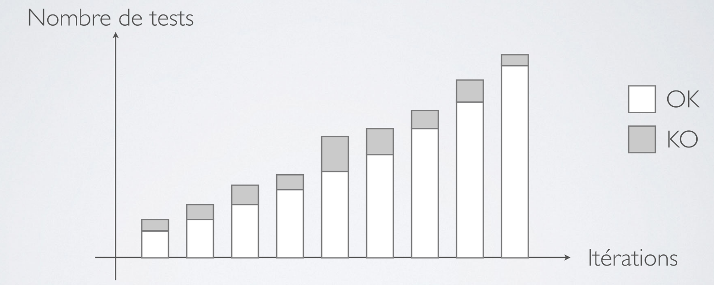
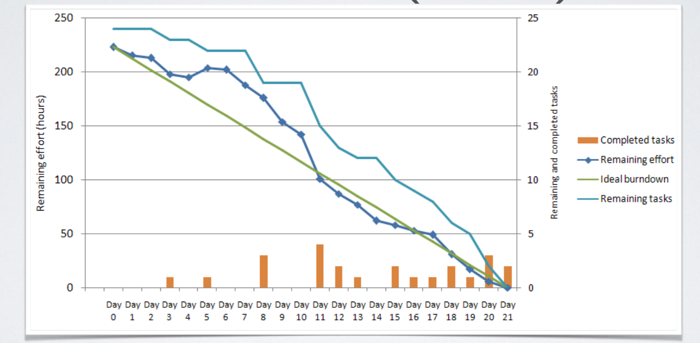

# Organisation de l'unité

      
<!-- _class: cool-list -->

### BIM1

- 2H par semaine de théorie
- 2H par semaine de laboratoires
   

  

    

### BIM2

- pas de cours théorique
- 6H par semaine de laboratoires
 

    

 

---

# Évaluation

      
<!-- _class: cool-list -->

### Théorie

- 20% de la note de l'unité

- QCM durant le Sprint 1 **en laboratoire**

- Exemples de questions durant les séances
   

  

    

### Laboratoires

- 80% de la note de l'unité

- **Présence obligatoire**

- Note pondérée par le taux de présence

- **Défense** de projet en fin de semestre

- **Pas de projet en seconde session** 

    

 

---  
<!-- _class: transition2 -->  
Partie 1 : Les méthodologies de projet

--- 

# Les grandes étapes d’un projet
<!-- _class: cool-list -->
1. *Appréhender le problème*
1. *Analyser le problème*
1. *Réaliser la solution*
1. *Tester*
1. *Déployer (mise en production)*
1. *Maintenir le logiciel dans le temps*

<!-- notes
Tout projet logiciel, qu’il soit mené en cascade ou en agile, suit globalement les mêmes grandes étapes. On commence par comprendre et analyser le problème, ensuite on conçoit une solution, on la réalise, on la teste, puis on la met en production. Enfin, un logiciel doit toujours être maintenu dans le temps, car les besoins évoluent, les bugs apparaissent, les technologies changent. La différence entre méthodologies, ce n’est pas vraiment quelles étapes on suit, mais plutôt comment on les organise, à quel moment on prend les décisions, et à quel rythme on livre de la valeur.
-->

--- 
# Clarifier les attentes : la collecte des besoins

Comprendre **ce que l’utilisateur attend** du système

Types de besoins/requirements :
  - Fonctionnels : **ce que le logiciel doit faire**
  - Non-fonctionnels : **performance, sécurité, ergonomie...**
  - Métier/domaine : **contraintes propres au contexte**

Rédaction du **Software Requirements Document** (SRD)

<!-- notes

La collecte des besoins, c’est une étape clé. Il s’agit de bien comprendre ce que l’utilisateur attend réellement du système. On distingue trois types de besoins : les besoins fonctionnels, qui décrivent ce que le logiciel doit faire concrètement ; les besoins non-fonctionnels, qui concernent la performance, la sécurité, l’ergonomie ; et enfin les besoins métier, qui traduisent les contraintes spécifiques au domaine. Dans une approche classique, on consigne tout cela dans un gros document, le Software Requirements Document. En agile, l’approche est plus légère et évolutive : on parle de user stories qui capturent l’essentiel des besoins tout en restant flexibles.

-->

---

# Qualité logicielle : une histoire de point de vue

La qualité n’a pas la même signification pour :

- le **Client** : respect du budget et des délais
- l'**Utilisateur** : facilité d’usage, fiabilité
- le **Développeur** : code maintenable, tests, performance
- le **Manager** : alignement avec les objectifs stratégiques

<!-- notes

La notion de qualité n’est pas la même pour tout le monde. Pour le client, c’est surtout de livrer dans les temps et sans exploser le budget. Pour l’utilisateur, c’est que le logiciel soit simple, fiable et agréable. Pour le développeur, la qualité se mesure dans un code maintenable, testé et performant. Enfin, pour le manager, c’est que le logiciel soit aligné avec la stratégie de l’entreprise. Comprendre ces différents points de vue est essentiel, car un projet échoue souvent non pas faute de compétences techniques, mais parce qu’on n’a pas bien aligné les attentes autour de ce mot : qualité.

-->

--- 
 
# Qualité logicielle

**Norme ISO 9000:2005** : Ensemble des caractéristiques d’une entité qui lui confèrent l’aptitude à satisfaire des besoins exprimés ou implicites.
   
Exemples de critères de qualité :

- Pertinence : le logiciel répond-il aux objectifs visés ?
- Apport de bénéfices : génère-t-il de la valeur pour l’utilisateur ?
- Fonctionnement correct : respecte-t-il les spécifications ?
- Performance : rapidité, consommation de ressources, fiabilité
- Facilité d’apprentissage : ergonomie et intuitivité
- Évolutivité : possibilité d’ajouter de nouvelles fonctionnalités
- Réutilisabilité : modularité et capacité à être utilisé dans d’autres contextes
- Portabilité : capacité à fonctionner sur différentes plateformes

<!-- notes

Si on regarde une définition plus “officielle”, la norme ISO nous dit que la qualité logicielle, c’est la capacité d’un logiciel à satisfaire des besoins exprimés ou implicites. Cela recouvre des critères très variés : la pertinence, les bénéfices concrets, le bon fonctionnement, les performances ; mais aussi des aspects plus humains comme la facilité d’apprentissage, la réutilisabilité, l’évolutivité ou la portabilité. Cette vision nous rappelle que la qualité ne se réduit pas à l’absence de bug : elle englobe tout ce qui rend un logiciel utile et durable dans son contexte.

-->

--- 

# Tour d’horizon des méthodologies

**Méthodologie : Procédé qui a pour objectif de permettre de formaliser les étapes préliminaires du développement d'un système afin de rendre ce développement plus fidèle aux besoins du client.**

RACINES
SCRUM
XP
Merise
3AR
MMTS
MASE
CISAD
MKSH

  

    
 
SART
MACAO
FAST
Unified Process
OOD
EVO
RAD
DSDM
Kanban

    

 

<!-- notes

Pour mettre en œuvre ces étapes et assurer la qualité, il existe de nombreuses méthodologies. Certaines sont orientées analyse, comme Merise ; d’autres mettent l’accent sur la rapidité, comme RAD ; d’autres encore sur la discipline, comme le Unified Process. Du côté agile, on trouve Scrum, Kanban, XP. Chaque méthode propose un cadre de travail différent, mais toutes visent le même objectif : mieux organiser la collaboration et transformer des besoins en un logiciel qui fonctionne.

RACINES : Méthode d’analyse et de conception basée sur les besoins fondamentaux du système.

SCRUM : Méthodologie agile centrée sur des itérations courtes et des équipes auto-organisées.

XP (eXtreme Programming) : Approche agile poussant les bonnes pratiques de développement à l’extrême pour la qualité du code.

Merise : Méthode structurée française pour l’analyse, la conception et la modélisation des systèmes d’information.

3AR : Méthode d’ingénierie des systèmes orientée architecture, analyse et rationalisation des besoins.

MMTS : Méthode de modélisation des systèmes techniques et logiciels pour la planification du développement.

MASE : Méthode d’analyse et de structuration des exigences pour les systèmes industriels et logiciels.

CISAD : Approche de conception des systèmes d’information centrée sur les besoins de l’utilisateur.

MKSH : Méthode de conception logicielle basée sur les modèles, pour gérer la complexité.

SART : Méthode structurée pour l’analyse et la résolution des tâches dans les projets logiciels.

MACAO : Méthode d’analyse et de conception orientée objets pour les systèmes d’information.

FAST : Développement rapide d’applications (Rapid Application Development), centrée sur prototypage et itérations.

Unified Process : Méthode itérative et incrémentale basée sur les cas d’utilisation et les meilleures pratiques.

OOD (Object-Oriented Design) : Conception orientée objet pour modéliser et développer des systèmes logiciels.

EVO (Evolutionary Project Management) : Gestion de projet itérative basée sur livraisons progressives et ajustements continus.

RAD (Rapid Application Development) : Développement rapide centré sur prototypage et retour utilisateur rapide.

DSDM (Dynamic Systems Development Method) : Méthode agile centrée sur le développement rapide et itératif avec gestion des priorités.

Kanban : Méthode visuelle de gestion de flux de travail pour améliorer l’efficacité et limiter le travail en cours.

-->

--- 

# Waterfall : comment tout est séquencé

<!-- notes

Le modèle en cascade, ou Waterfall, est l’approche historique. Ici, les étapes sont bien ordonnées et séquentielles : on commence par tout définir, puis on conçoit, ensuite seulement on code, on teste et on livre. L’image de la cascade illustre bien cette logique descendante, où l’on ne revient pas en arrière. Cette méthode est très structurée, elle a l’avantage de donner une grande visibilité et un plan clair, mais elle suppose que l’on connaisse très précisément les besoins dès le départ… ce qui n’est pas toujours réaliste.

-->

--- 

# Waterfall : quand la définition bloque le projet

<!-- _class: cool-list -->

1. *Définition du cahier des charges*
1. *puis, document de spécifications*
1. *puis, document de conception générale*
1. *puis, document de conception détaillée*
1. *puis, plans de tests*
1. *et finalement... on code l’application !*

<!-- notes

Les limites de la cascade viennent du fait qu’on doit tout définir à l’avance. On commence par un cahier des charges très complet, suivi de spécifications, de conceptions générales et détaillées, puis des plans de test. Ce n’est qu’une fois tout cela terminé qu’on commence à coder. Le problème, c’est que dans le monde réel, les besoins changent, les utilisateurs découvrent ce qu’ils veulent en cours de route. Et plus on est loin dans le projet, plus il est coûteux de revenir en arrière. C’est ce qui a motivé la recherche de méthodes plus souples.

-->

--- 

# Succès et échecs de projets selon le Chaos Report

<figcaption align="center">
<b>Figure</b>: Source: Ambysoft, 2013 IT Project Success Rates Survey Results, 2013.
</figcaption>

<!-- notes

Le Chaos Report, une étude bien connue, a montré que les projets menés en cascade réussissaient beaucoup moins souvent que ceux menés en agile. Dans certains chiffres, moins de 15 % des projets en cascade aboutissaient sans problème, alors qu’en agile on atteignait plus de 40 %. Ce n’est pas que l’agile soit une recette miracle, mais simplement que cette approche gère mieux l’incertitude et l’évolution des besoins. Ce constat a poussé de nombreuses entreprises à revoir leur manière de gérer les projets informatiques.

-->

--- 

# Waterfall : dans quels cas ça marche ?

**Attention** la méthode en cascade possède ses avantages : 

- Découpe en phases permettant une parallélisation
- Utile si besoin de tout spécifier avant de construire
- Par exemple: si la construction est onéreuse, si la qualité de chaque étape doit être évaluée finement, …

<!-- notes

Attention toutefois : la méthode en cascade a encore ses avantages. Elle est utile lorsqu’on doit absolument tout spécifier avant de construire, par exemple dans des projets industriels lourds, dans l’aéronautique, dans les infrastructures. La découpe en phases permet aussi une bonne répartition des responsabilités et un suivi rigoureux. En clair, la cascade n’est pas “mauvaise” : elle est adaptée à des contextes où les besoins sont stables et où le coût d’un changement est prohibitif.

-->

--- 

# Une première évolution : le cycle en V

<!-- notes

Après avoir vu le modèle Waterfall, qui est linéaire et séquentiel, le cycle en V est apparu comme une évolution naturelle pour mieux gérer la qualité.

Le cycle en V reprend les mêmes phases que Waterfall – analyse, conception, développement, tests – mais met l’accent sur la correspondance entre chaque étape de conception et une étape de test.

Si vous regardez le schéma, vous voyez que les phases descendent d’un côté, puis remontent en forme de V. Chaque phase de spécification a sa phase de test correspondante :

Les spécifications fonctionnelles sont vérifiées par des tests d’acceptation.

La conception détaillée est vérifiée par des tests unitaires.

La conception générale est vérifiée par des tests d’intégration.

L’intérêt principal est donc de relier directement chaque étape à son contrôle de qualité, ce qui réduit les erreurs qui passent entre les mailles et rend le processus plus sûr, surtout pour des projets critiques.

Cependant, le cycle en V reste assez rigide, comme Waterfall : il faut bien définir les besoins avant de commencer, et il n’est pas très flexible face aux changements en cours de projet.

-->

--- 

# Nouvelle évolution : le cycle en spirale

.svg)

<!-- notes

Le cycle en spirale, proposé par Barry Boehm en 1988, est une réponse aux limites des approches linéaires et rigides comme Waterfall et le cycle en V.

Au lieu de suivre un chemin strictement descendant, la spirale combine itérations et analyse des risques. Chaque tour de spirale correspond à une phase complète du projet, incluant :

L’analyse des objectifs et des alternatives,

L’évaluation des risques,

Le développement et les tests,

La planification du prochain cycle.

L’avantage est que l’on commence rapidement avec un prototype, puis on répète les étapes en affinant le produit et en réduisant les risques à chaque itération. Cela permet de s’adapter aux changements, d’intégrer le feedback des utilisateurs, et de mieux maîtriser les incertitudes.

En résumé, si Waterfall est linéaire et le cycle en V met l’accent sur les tests, la spirale introduit l’itération, l’évaluation des risques et la flexibilité, des idées qui préfigurent ce que l’on retrouve aujourd’hui dans les méthodes agiles.

-->

--- 

# Agile : une alternative au Waterfall

**Les individus et leurs interactions** plus que les processus et les outils.

**Un logiciel qui fonctionne** plus qu’une documentation exhaustive.

**La collaboration avec les clients** plus que la négociation contractuelle.

**L’adaptation au changement** plus que le suivi d’un plan.

> [Manifeste agile](https://manifesteagile.fr/)

<!-- notes

L’agile, c’est un changement de philosophie. Le manifeste agile de 2001 met en avant quatre valeurs : les individus et leurs interactions plutôt que les processus, un logiciel qui fonctionne plutôt que la documentation, la collaboration avec le client plutôt que la négociation, et l’adaptation au changement plutôt que le suivi rigide d’un plan. Ce n’est pas une recette unique, mais un ensemble de principes pour travailler de manière plus souple, plus réactive et plus centrée sur l’utilisateur.

-->

--- 

# Comment l’agile a évolué

**EVO** (Evolutionary Project Management) (1976)

**RAD** (Développement rapide d'applications) (1991)

**DSDM** (Dynamic System Development Method, la version anglaise du RAD) (1994)

**Kanban** (issue de la méthode industrielle Lean, Toyota)

**XP** (par Kent Beck) (1999)

**Scrum** (par Ken Schwaber et Jeff Sutherland) (2001)

<!-- notes

L’agilité n’est pas née d’un coup. Dès les années 70, des approches comme EVO cherchaient déjà à rendre les projets plus évolutifs. Les années 90 ont vu apparaître RAD, DSDM, puis Kanban dans l’industrie. À la fin des années 90, Kent Beck a popularisé XP, et en 2001 Scrum a été formalisé par Schwaber et Sutherland. On voit donc une maturation progressive, qui a culminé avec le manifeste agile. Aujourd’hui, ces méthodes sont devenues des standards dans le développement logiciel.

-->

--- 

# Agile : changer de perspective

<!-- notes

Passer de la cascade à l’agile, c’est changer de manière de voir le projet. Dans la cascade, on est dans une logique linéaire, planifiée, où l’on avance étape par étape comme un grand navire qui suit sa route. En agile, on est plus proche d’un voilier : on garde un cap, mais on ajuste en permanence la voile selon le vent et les conditions. Ce changement de référentiel, c’est accepter que l’incertitude fait partie du projet, et que l’adaptation est une force plutôt qu’un défaut.

-->

--- 

# Une méthode agile : l'eXtreme Programming (XP)

XP favorise l’agilité à plusieurs niveaux :
- **Code** : qualité, tests automatisés, refactoring
- **Équipe** : collaboration, communication, pair programming
- **Gestion de projet** : itérations courtes, livraisons fréquentes, adaptation au changement
- **Valeurs** : approche humaine, confiance, simplicité et vision positive du développement

<!-- notes

Parmi les méthodes agiles, XP est l’une des plus connues pour sa focalisation sur le code. XP cherche l’agilité à trois niveaux : le code lui-même, avec des pratiques comme le refactoring et les tests automatisés ; l’équipe de développement, avec du pair programming ou un rythme de travail durable ; et la gestion de projet, avec des itérations courtes et un dialogue permanent avec le client. XP a aussi une dimension humaniste : valoriser la communication, la confiance et le respect entre développeurs.

-->

---

# Rôles, pratiques, artifacts et valeurs

**Rôles** : Client, Testeur, Développeurs, Coach

**Artifacts** : Logiciel, Histoires, Scénarios de tests

**Pratiques** : Livraisons fréquentes, Planification itérative, Client sur site,Rythme durable, Pair Programming, Responsabilité collective du code

**Valeurs** : Communication, Simplicité, Feedback, Courage

<!-- notes

Dans XP, on définit plusieurs rôles : le client, qui exprime les besoins ; les développeurs ; les testeurs ; et un coach qui aide l’équipe à rester fidèle aux principes. Les artefacts sont les logiciels livrés régulièrement, les histoires utilisateurs, et les scénarios de tests. Les pratiques incluent la livraison fréquente, la planification itérative, la présence du client sur site, le pair programming, la responsabilité collective du code. Et tout cela repose sur des valeurs : communication, simplicité, feedback, courage.

-->

--- 
 
<!-- _class: cite -->        

**XP pousse à l’extrême certaines bonnes pratiques** pour maximiser la qualité et l’adaptabilité : tests automatisés, refactoring fréquent, collaboration constante avec le client, livraisons rapides.

<!-- notes

-->

--- 

# Les limites de l’agilité

**Dérives commerciales** : certaines entreprises exploitent l’agile comme un argument marketing plutôt qu’une véritable pratique

**Imposition aux équipes** : appliquer l’agile sans appropriation par les développeurs peut créer des frustrations

**Faux-agile** : suivre les rituels sans respecter les principes fondamentaux (rituels vides, “cargo-cult agile”)

<!-- notes

Enfin, il ne faut pas croire que l’agile est parfait. Comme toute approche, il a ses limites. Certaines entreprises détournent l’agile pour en faire un produit commercial, sans respecter l’esprit. Parfois, on impose l’agile aux équipes sans leur donner le temps de s’approprier les pratiques. On parle alors de “faux-agile” ou “cargo-cult agile”, où l’on suit des rituels sans en comprendre le sens. La clé, c’est de garder un regard critique et de s’assurer que l’agile reste au service du projet et de l’équipe, et non l’inverse.

-->

---

# Mise en situation 💬
 
Un membre de l'équipe annonce qu'il a commencé une tâche il y a deux jours  
mais qu'elle n'est toujours pas terminée. Il ajoute qu'il **devrait la finir demain**, mais ne s'engage pas fermement.

**Que feriez-vous dans cette situation ?**  

- A. Attendre que la tâche soit finie sans intervenir  
- B. Relancer le membre de l'équipe pour comprendre le problème  
- C. Proposer de l'aider ou de réévaluer la charge de travail  
- D. Escalader directement au manager  

<!-- notes

-->

---
<!-- _class: transition2 -->  

Partie 2 : Gestion de projet XP

---
# Guide : les 4 valeurs XP

1. **Communication**  
   - Favoriser les échanges constants entre développeurs et client  
   - Questions et réponses rapides pour éviter les malentendus

2. **Simplicité**  
   - Concevoir et coder uniquement ce qui est nécessaire  
   - Éviter les solutions complexes ou prématurées

3. **Feedback**  
   - Recevoir des retours fréquents via tests, livraisons et stand-ups  
   - Permet d’ajuster rapidement le produit et les priorités

4. **Courage**  
   - Corriger les erreurs sans délai  
   - Remettre en question les décisions passées si nécessaire

<!-- notes

-->

--- 

# Les principes de la démarche XP

**Trouver un rythme soutenable** : avancer régulièrement sans surcharge  

**Redéfinir fréquemment le projet** : intégrer les retours et ajuster la direction  

**Maintenir l’équilibre** : coopération constante entre développeurs et client 

**Pratiques poussées à l’extrême** : tests, intégration continue, feedback rapide 

<!-- notes

-->

---         
<!-- _class: transition -->  

 Les principes de la démarche XP  en détails

---
# Principe I : Trouver un rythme soutenable

Un projet est toujours contraint par 4 variables :  

- Le **coût** : salaire, matériel, charge, toutes les consommations exprimée en €
- Les **délais** : retards fragilisent la confiance et augmentent les coûts indirects  
- La **qualité** : réduire la qualité augmente le temps de développement futur  
- Le **contenu** : la seule variable réellement ajustable   

<!-- notes

-->

---

# Principe I : Trouver un rythme soutenable

Aller trop vite ou trop lentement nuit au projet :  

- **Trop vite** : code bâclé, dette technique, régressions fréquentes  
- **Trop lentement** : perte de valeur, frustration du client, coûts accrus  

L’objectif en XP est de **trouver un rythme soutenable** qui permet de livrer en continu **sans sacrifier la qualité**.

<!-- notes

-->

---

# Principe II : (Re)définir fréquemment le projet

- **Waterfall** : « Visez… feu ! Raté… »  
- **XP** : « Feu ! Visez… visez… visez… »  

En XP, le projet n’est pas figé : il est **réévalué en continu** pour rester aligné avec les besoins. Les spécifications sont définies tout au long du projet.

<!-- notes

-->

---

# Principe II : (Re)définir fréquemment le projet
## Phase initiale

Le projet commence par une **exploration globale** :  
- Comprendre le problème et les besoins du client  
- Identifier les contraintes et choix techniques majeurs  
- Établir une estimation initiale des coûts et délais  
- Rester à un **niveau de granularité large** (pas de détails prématurés)  

<!-- notes

-->

---

# Principe II : (Re)définir fréquemment le projet
## Création d'un plan de livraisons

- Élaboré à partir des estimations initiales  
- Le **client fixe les priorités** : les fonctionnalités les plus importantes en premier  
- Livraison rapide pour obtenir des retours concrets  
- Les versions successives apportent progressivement de la valeur  

<!-- notes

-->

---

# Principe II : (Re)définir fréquemment le projet
## Ajustements en continu

- Le **plan peut évoluer** : ajout, retrait, ou report de fonctionnalités  
- Les décisions s’appuient sur :  
  - l’expérience acquise au fil du projet  
  - les retours utilisateurs  
  - les coûts estimés de chaque itération  
- On ajuste surtout la **variable "contenu"** du projet, tout en gardant rythme, coût et qualité stables 

<!-- notes

-->

---

# Principe III : Maintenir l’équilibre

La démarche XP ne fonctionne que si **client et développeurs coopèrent** :  
- Si le **client a trop de pouvoir**, il impose l’impossible et épuise l’équipe  
- Si les **développeurs dominent**, ils risquent de construire une solution trop générique, inutile pour le client  

XP cherche à maintenir un **équilibre durable**.

<!-- notes

-->

---

# Principe III : Maintenir l’équilibre

À chaque itération, le projet avance grâce à un **cycle de collaboration** :  

1. **Client** : définit les fonctionnalités souhaitées  
2. **Développeurs** : estiment le coût et la faisabilité  
3. **Client** : sélectionne les fonctionnalités prioritaires  
4. **Développeurs** : implémentent et livrent une nouvelle version  

<!-- notes

-->

---

# Principe IV : Des pratiques poussées à l’extrême

**Client sur site** : le client participe au quotidien pour guider et prioriser  

**Rythme durable** : avancer régulièrement sans surcharge de l’équipe  

**Livraisons fréquentes** : petites versions livrées souvent pour obtenir des retours  

**Planification itérative** : ajuster le plan à chaque cycle selon l’expérience acquise  

<!-- notes

-->

---         
<!-- _class: transition -->  

 Les pratiques XP  en détails

---

# Pratique I : Client sur site
## Principe

Favoriser la communication directe entre programmeurs et client :  
- Idéalement dans le même bâtiment, voire le même bureau  
- Questions → réponses immédiates, sans lourdeur documentaire  
- Pas besoin de cahier des charges figé : la **communication permanente** fait office de spécification  

<!-- notes

-->

---

# Pratique I : Client sur site
## Le rôle du client

- Apporte son expertise métier et clarifie les besoins  
- Répond directement aux questions fonctionnelles  
   - **Waterfall** : le développeur doit deviner une solution, parfois erronée  
   - **XP** : le client est présent pour lever toute ambiguïté  
- Définit les **tests de recette** (acceptance tests), souvent automatisés → équivalent des spécifications fonctionnelles  

<!-- notes

-->

---

# Pratique I : Client sur site
## Les limites pratiques

- Difficile d’avoir un client disponible en permanence  
- Plusieurs personnes peuvent partager ce rôle  
- Mais il faut limiter le nombre d’intervenants pour garder la cohérence  

La présence du client (ou d’un représentant) reste un **facteur clé de succès en XP**.  

<!-- notes

-->

---
# Pratique II : Rythme durable
## Trouver l’équilibre

- Un projet réussi demande **énergie et régularité**  
- L’équipe doit avoir du temps pour :  
  - concevoir simplement  
  - coder proprement  
  - tester correctement  
  - résoudre les problèmes  
- La qualité dépend directement de la capacité à travailler **sans épuisement**  

<!-- notes

-->

---

# Pratique II : Rythme durable
## La règle XP

- En XP : **pas d’heures supplémentaires deux semaines de suite**  
- Les surcharges répétées provoquent une baisse de qualité, des bugs, la démotivation  
- Si l’équipe n’avance pas dans un rythme normal :  
  - on cherche la **véritable cause** (organisation, dépendances, priorités)  
- L’objectif est un rythme **soutenable**, garant de la qualité et de la motivation à long terme  

<!-- notes

-->

---

# Pratique III : Livraisons fréquentes
## Principes

- Première livraison très rapide pour **éviter les malentendus et gagner la confiance du client**  
- Livraisons suivantes rapprochées pour **un pilotage précis et des preuves régulières d’avancement**  
- Les livraisons peuvent être **quotidiennes** grâce à :  
  - l’intégration continue  
  - les tests automatisés  
- Limites possibles : processus lourd, validations externes, logiciels embarqués

<!-- notes

-->

---

# Pratique III : Livraisons fréquentes
## Avantages

- **Feedback client régulier** qui permet un ajustement des besoins pour les livraisons suivantes  
- **Feedback équipe** :  
  - sentiment de « travail fini »  
  - motivation entretenue  
  - meilleure visibilité sur la qualité du produit  
- **Logiciel confronté à l’environnement réel** ce qui permet une détection précoce des problèmes de performance ou compatibilité

<!-- notes

-->

---
# Pratique IV : Planification itérative

- Les **livraisons fréquentes** définissent quand le logiciel est livré, mais pas **quoi** livrer  
- La **planification itérative** définit le contenu de chaque livraison  
- Se fait lors de **séances collectives** appelées **planning game**  
  - Aspect « jeu » : moins de tension, collaboration renforcée  
  - Objectif : tirer le meilleur produit du projet

<!-- notes

-->

---
# Pratique IV : Planification itérative
## Itérations et livraisons

- Le projet est découpé en **itérations** et **livraisons** :  
  - **Itération** : 1 à 3 semaines, développement d’un petit ensemble de fonctionnalités  
  - **Livraison** : regroupement d’itérations aboutissant à un produit utilisable  
- Les itérations permettent de **réévaluer les priorités** et ajuster le contenu des prochaines livraisons 

<!-- notes

-->

--- 

# Pratique IV : Planification itérative

<!-- notes

-->

---

# Pratique IV : Planification itérative 
## Phase d’exploration des livraisons
### Définition des scénarios

- Le client définit des **scénarios simples** (user stories)  
  - Histoire complète avec début et fin  
  - Rédigés par le client, souvent avec un coach  
  - Dans un langage simple, à la main  
- Objectif : décrire l’interaction entre utilisateur et système pour chaque fonctionnalité  
- Granularité sommaire, facile à manipuler et à partager  

<!-- notes

-->

---

# Pratique IV : Planification itérative
## Phase d’exploration des livraisons
### Manipulation et organisation des scénarios

- Chaque scénario est écrit sur une **fiche cartonnée (A5)** :  
  - Permet de manipuler, trier, fusionner ou supprimer facilement  
  - Les fiches remplacent les documents lourds ce qui respecte la valeur simplicité
- Exemple de fiche : user story + points + priorité + risque technique  
- Les détails seront complétés oralement lors des échanges avec les développeurs  

<!-- notes

-->

---

# Pratique IV : Planification itérative

---

# Pratique IV : Planification itérative
## Phase d’exploration des livraisons
### Planning game

- Chaque scénario est **priorisé par le client**
   - P1 = indispensable, P2 = essentiel, P3 = utile  
- Le planning game permet de :  
  - Discuter des scénarios avec l’équipe  
  - Répartir les scénarios dans les itérations pour livrer les plus importantes d’abord  
- Collaboration client-développeurs → ajustement des priorités et clarification des besoins  

<!-- notes

-->

---

# Pratique IV : Planification itérative
## Phase d’exploration des livraisons 
### Estimation des scénarios

- Les développeurs évaluent **en points** : difficulté et envergure  
- Points comparatifs → 1 point = 1 unité de temps idéal (ex. 1 heure ou 1 jour selon projet)  
- Intègre code, documentation, tests unitaires et tests de recette  
- En cas d’inconnues techniques → prototypes rapides (**spikes**) pour estimer  

<!-- notes

-->

---

# Pratique IV : Planification itérative
## Phase d’exploration des livraisons 
### Estimation en heures à éviter

- **Illusion** de précision  
- Difficilement comparable entre personnes  
- **Bloque la discussion** sur la valeur vs l’effort  
- Les points permettent une **abstraction** utile  

---

# Pratique IV : Planification itérative
## Phase d’exploration des livraisons : Poker Planning

<!-- notes

-->

---
# Pratique IV : Planification itérative
## Phase d’exploration des livraisons : Suite de Fibonacci

| Points | Exemple de Story |
|--------|------------------|
| 1      | Correction d’un bug mineur |
| 3      | Formulaire simple avec 2 champs |
| 5      | Fonctionnalité avec règles métiers |
| 8      | Nouvelle page avec intégration API |
| 13+    | Trop gros → découpage nécessaire |

> **T-shirt sizes** (XS, S, M, L, XL) 

---

# Pratique IV : Planification itérative
## Phase d’exploration des livraisons 
### Scission et fusion des scénarios

- Scission : scénario trop gros → découper en plusieurs pour mieux gérer
- Fusion : scénarios très petits → regrouper pour simplifier l’estimation  
- Objectif : obtenir des **unités de travail cohérentes et estimables**  

> EPIC : grand récit qui sera composé de nombreux récits utilisateurs

<!-- notes

-->

---
# Pratique IV : Planification itérative
## Phase d’exploration des livraisons 
### Chaque user story doit être **INVEST** :  

- **I**ndépendante : peut être développée seule  
- **N**égociable : flexible, pas figée dès le départ  
- **V**alueable : apporte de la valeur au client ou à l’utilisateur  
- **E**stimable : suffisamment claire pour estimer l’effort  
- **S**mall (Petite) : réalisable en un seul sprint ou itération  
- **T**estable : critères de succès précis et vérifiables

---

# Pratique IV : Planification itérative
## Phase d’exploration des livraisons
### Durée et pratique

- Jusqu’à ce que tous les scénarios soient définis et estimés  
- **Premières itérations** : plusieurs heures à quelques jours  
- **Itérations suivantes** : quelques heures suffisent  
- Dépend de la **vision à long terme** : bien définir les besoins permet de mieux planifier et estimer le projet  

<!-- notes

-->

---

# Pratique IV : Planification itérative
## Phase d'engagement des livraisons

Il faut répartir les scénarios dans les livraisons à venir pour établir le **plan de livraison**  

Processus général :  
1. **Client** : tri des scénarios par priorité (déjà effectué au début du planning game)
2. **Équipe** : tri par risque technique (fort, moyen, faible)  
3. **Client** : sélection et répartition dans les livraisons  
4. **Équipe** : annonce la vélocité disponible  

<!-- notes

-->

---

# Pratique IV : Planification itérative
## Phase d'engagement des livraisons : tableau priorités / risques

- Visualisation des scénarios selon **priorité** et **risque** :  

| Priorité \ Risque   | Fort      | Moyen     | Faible    |
|--------------------|-----------|-----------|-----------|
| P1 indispensable   | 📄 📄     | 📄       | 📄 📄 📄  |
| P2 essentiel       | 📄       | 📄 📄     | 📄       |
| P3 utile           |           | 📄       | 📄 📄     |

- Chaque 📄 représente un scénario (user story)  
- Permet de **planifier intelligemment** quelles histoires seront implémentées en premier  
- Favorise l’équilibre entre valeur métier et complexité technique

<!-- notes

-->

---

# Pratique IV : Planification itérative
## Phase d'engagement des livraisons : vélocité et répartition

- **Vélocité** : total des points des scénarios **terminés correctement** dans l’itération précédente  
- Permet au client de savoir **combien de points “dépenser”** pour choisir les scénarios de la prochaine livraison  
- Première itération : coach fournit une estimation initiale  
- Répartition :  
  - Le client choisit des scénarios dont la somme des points ≈ vélocité  
  - Priorité aux scénarios les plus importants  
- Le coach veille à **l’équilibre client / développeurs** et au respect du rythme durable

<!-- notes

-->

---

# Pratique IV : Planification itérative
## Phase de pilotage des livraisons : suivi et indicateurs

- Il faut  **contrôler l’avancement et la qualité** du projet  
- Deux indicateurs clés :  

1. **Suivi des tests de recette**  
   - Valide que les fonctionnalités livrées correspondent aux besoins  
   - Permet de détecter rapidement les anomalies ou régressions  

2. **Burndown chart (Scrum)**  
   - Représente l’avancement du travail restant sur une itération  
   - Permet au client et à l’équipe de visualiser la progression et d’ajuster le plan  

<!-- notes

-->

---

# Pratique IV : Planification itérative
## Phase de pilotage des livraisons - Suivi des tests de recette

<!-- notes

-->

---

# Pratique IV : Planification itérative
## Phase de pilotage des livraisons - Burndown chart (Scrum)

<!-- notes

-->

---

# Pratique IV : Planification itérative
## Phase de pilotage des livraisons : gestion des défauts

- Il faut **corriger les anomalies rapidement** en maintenant le rythme du projet  
- Lorsqu’un défaut apparaît, il faut :  
  1. **Créer un scénario de correction**  
     - Estimer le coût de la réparation en points  
     - Marquer le scénario comme **priorité maximale**  
  2. **Ou corriger immédiatement** si le défaut bloque le développement  
     - Normalement, les défauts sont **rares** et critiques  

- L’équipe choisit la stratégie en fonction de **l’impact du défaut** sur la livraison et la continuité des itérations

<!-- notes

-->

---

# Pratique IV : Planification itérative
## Fin d’un cycle de livraison

- La **phase de pilotage** s’arrête à la livraison :  
  - Livraison effectuée même si tous les scénarios ne sont pas terminés  
  - On joue sur la **variable contenu**, pas sur les délais  
- Importance de **célébrer la livraison** pour motiver l’équipe (repas, feedback, reconnaissance)  

<!-- notes

-->

---

# Pratique IV : Planification itérative
## Début d’un nouveau cycle de livraison

- Redéfinir les **durées effectives** de réalisation des scénarios  
- Mettre à jour les estimations des scénarios restants si nécessaire  
- Déterminer plus précisément la **vélocité de l’équipe** pour la prochaine itération  
- Objectif : planifier les prochaines livraisons avec réalisme et fiabilité  

<!-- notes

-->

---

# Pratique IV : Planification itérative
## Dernière livraison - La fin du projet

- Décision du **client** : Le projet se termine lorsque les scénarios restants ne justifient plus l’investissement  
- Les critères : valeur métier, coût, priorité restante  
- Permet de clore le projet de manière **raisonnée et contrôlée**

<!-- notes

-->

--- 

# Pratique IV : Planification itérative

<!-- notes

-->

---

# Pratique IV : Planification itérative
## Les itérations : phase d’exploration

À chaque début d’itération :  
- Les développeurs posent toutes les **questions au client** pour clarifier les scénarios  
- Division des scénarios en **tâches techniques** (en présence du client)  
  - 1 tâche ≈ 2 à 4 heures pour un binôme  
  - Souvent un peu de conception est nécessaire  

**Exemple** :  
Scénario : "L’utilisateur peut conserver ses adresses favorites"  
- Tâches : "Créer la classe SitePréféré", "Ajouter une option au menu Adresses"

<!-- notes

-->

---

# Pratique IV : Planification itérative
## Les itérations : phase d’engagement

- **Choix et estimation des tâches** :  
  - Développeur volontaire → responsable de la tâche  
  - Estimation en heures de "temps idéal" par comparaison avec tâches précédentes  
- **Équilibrage des charges** :  
  - Répartir uniformément la charge entre développeurs  
  - Binômes : 50% du temps pour les tâches personnelles  
- **Répartition dans le tableau** : colonnes = Tâche | Qui | Temps prévu | Finie  
- **Ajustement des scénarios** : ajout ou suppression si certains développeurs sont sous-chargés  

<!-- notes

-->

---

# Pratique IV : Planification itérative
## Les itérations : tableau de répartition des tâches

| Tâche                        | Qui         | Temps prévu | Finie |
|-------------------------------|------------|------------|-------|
| Créer la classe SitePréféré   | Alice/Bob  | 3 h        | ❌    |
| Ajouter option au menu Adresses | Charlie/Dave | 2 h     | ✅    |
| Implémenter sauvegarde favoris | Alice/Bob | 4 h        | ❌    |
| Tests unitaires SitePréféré    | Charlie/Dave | 2 h      | ✅    |

- Chaque ligne représente une tâche issue d’un scénario  
- **Qui** : binôme responsable  
- **Temps prévu** : estimation en heures de temps idéal, **équilibrage nécessaire**

<!-- notes

-->

---

# Pratique IV : Planification itérative
## Les itérations : phase de pilotage

- **Stand-up meetings** :  
  - 10 minutes par jour, debout  
  - Chaque développeur fait un point rapide sur sa situation  
  - Pas une réunion technique 
- **Suivi régulier** : deux fois par semaine, le tracker demande :  
  - Temps passé sur chaque tâche et temps restant estimé  
- **Gestion des dérapages** :  
  - Brainstorming pour simplifier les tâches  
  - Faire intervenir un binôme plus expérimenté  
  - Réattribuer la tâche si nécessaire   ou retirer un scénario si toute l’équipe est surchargée  

<!-- notes

-->

---

# Pratique IV : Planification itérative
## Fin d’itération

- **Mini-livraison du logiciel au client**  
  - Tous les tests de recette passent  
  - Mise à jour des coûts des scénarios réalisés (somme des durées des tâches)  
- **Célébration** : boissons, gâteaux, reconnaissance du travail accompli

<!-- notes

-->

---
<!-- _class: transition2 -->  

Partie 3 : Gestion d'équipe XP

--- 
 
# Organisation et rôles en XP

Une bonne équipe = plus de chance de réussite  
- Bonne équipe ≠ seulement bonnes compétences techniques  
- Esprit d’équipe primordial  
- XP favorise collaboration et responsabilisation  
- Chaque membre a **un rôle défini** 

--- 

# Rôles

<!-- _class: cool-list -->

1. *Programmeur·se - Développeur·se*
1. *Client·e*
1. *Testeur·se*
1. *Tracker*
1. *Manager*
1. *Coach*

  

   

    

   

--- 
# Programmeur·se : Tâches au sein de l'équipe

<!-- _class: cool-list -->

1. *Coder*  
1. *Tester*
1. *Écouter le client pour rédiger de bons tests*   
1. *Concevoir (design)*
 

  

---
<!-- _class: cite -->        

**Ses qualités humaines sont aussi importantes que ses qualités techniques.**

--- 
# Programmeur·se : senior et junior

Au sein d’une équipe
- il faut des éléments **expérimentés** avec l’envie de **partager**
- les éléments **moins expérimentés** doivent avoir l’envie **d’apprendre**
- le cadre d’XP est idéal pour l’apprentissage grâce à la communication

--- 
# Programmeur·se : motivation

Pour motiver chaque programmeur·se, XP responsabilise chacun
- dans le code, les tests, l’écoute du client
- Seuls les programmeurs vont définir les charges et les délais
- Pas les clients, le manager, le coach, ..

---

# La charte des droits du programmeur·se

**Développeur·ses, vous avez le droit**
- de savoir ce qui est demandé, avec des **priorités clairement déclarées**
- de fournir un **travail de qualité** en toute occasion
- de demander et **recevoir de l’aide** de la part de vos pairs, de vos clients
- d’émettre et de réviser vos propres **estimations** de coûts
- d’**accepter des responsabilités**, qui ne peuvent vous être imposées
- de travailler à un **rythme de travail durable**

---

# Client·e : Tâches au sein de l'équipe

<!-- _class: cool-list -->

1. *Définit ce que fait le logiciel et comment*
1. *Communication constante avec l’équipe*
1. *Définit besoins via scénarios (user stories)*
1. *SPOC : Single person of contact*

  

---

# Client·e : Profil idéal

   

*On choisit le **vrai** client ou un représentant (proxy)*

Si impossible, on désigne un client artificiel qui jouera ce rôle

    

  

---

# La charte des droits du client·e

Client·e, vous avez le droit :

- **à un plan d’ensemble**, montrant ce qui peut être accompli, pour quand, à quel coût
- d’**obtenir le plus de valeur possible** de chaque semaine de programmation
- de **voir des progrès** sur une application qui marche, comme doivent le prouver les tests répétables que vous spécifiez
- de **changer d’avis**, de substituer des fonctionnalités et de changer vos priorités sans en payer un prix exorbitant
- d’**être informé** des modifications portées au calendrier de réalisation, assez tôt pour avoir la possibilité de réduire le périmètre fonctionnel et retomber ainsi sur la date de livraison initiale
- d’**annuler le projet à tout moment** et de disposer d’une application utile et utilisable en contrepartie de vos investissements à ce jour

---

# Testeur·se : Tâches au sein de l'équipe

- Tous les tests doivent être **automatisés**
- Met en place les **outils** nécessaires (phase d’exploration)
- Vérifie que toutes les demandes sont **testables**
- Bras droit du client : les **tests de recette** expriment les besoins
- Fait le lien avec les programmeurs pour assurer la **testabilité automatique** (y compris UI)

---

# Testeur·se : Collaboration avec le client

- Début d’itération : aide le client à **définir les tests de recette**
- Chaque scénario donne lieu à **au moins un test de recette**
- Les tests doivent être fournis **au plus tard au milieu de l’itération**
- Fin d’itération : si tous les tests passent, l’itération est **terminée**

---

# Testeur·se : Communication et Motivation

- Informe les programmeurs des progrès effectués  (graphiques visibles, notifications, célébrations)
- Encourage une vision partagée des objectifs
- Garant·e de la **qualité continue** du produit

---

# Testeur·se : Profil idéal

- **Polyvalent·e** et créatif·ve (bricoleur·se d’outils)
- **Rigoureux·se** et **intègre**
- Bon·ne communicant·e, esprit d’équipe
- Aime chercher les **problèmes cachés**
- Sait annoncer les mauvaises nouvelles

---

# Tracker : Tâches au sein de l'équipe

- Suit l’évolution des **histoires** et **tâches** à chaque itération
- Vérifie régulièrement l’avancement (au moins 2 fois/semaine)
- Détecte rapidement les **difficultés** rencontrées par l’équipe
- Sert de **révélateur** de problèmes, sans chercher à les résoudre
- Remonte les blocages éventuels au **coach**

---

# Tracker : Posture et difficultés

- Ne doit pas mettre de **pression** supplémentaire sur les programmeurs
- Doit savoir **faire parler** les membres de l’équipe
  («Ta tâche devait prendre 3 jours, tu en es à 2, qu’en penses-tu ?»)
- Reste neutre : observe, questionne, alerte

---

# Tracker : Profil idéal

- **Affable**, inspire confiance, non intrusif·ve
- À qui on se confie facilement
- De préférence **pas programmeur·se**, pour éviter les débats techniques

---

# Manager : Tâches au sein de l'équipe

- Supérieur technique des programmeurs, **extérieur à l’équipe XP**
- Gère la **logistique** : locaux, matériel, recrutement, paie
- Suit les **résultats concrets et visibles** du projet
- Ne correspond pas forcément au rôle de chef de projet traditionnel
- Demande des comptes à l’équipe tout en respectant le processus XP

---

# Manager : Posture et difficultés

Il doit avoir le courage de laisser se dérouler le processus
- Pas exiger des fonctionnalités si les programmeurs émettent un contre avis
- Il doit veiller au respect:
- des engagements
- des avantages promis par la méthode
- Si le projet est inclus dans un plus grand projet, il coordonne le tout

---

# Manager : Profil idéal

Souvent le chef de service de l’équipe
- Chef de projet global si le projet est inclus dans un projet plus grand
- Ou coordinateur technique.

- Souvent chef·fe de service de l’équipe  
- Peut être **chef·fe de projet global** si le projet s’inscrit dans un programme plus large  
- Peut également agir comme **coordinateur·rice technique**

---

# Coach : Tâches au sein de l'équipe

- Membre à part entière de l’équipe
- S’assure que :
  - chacun joue son rôle
  - les pratiques XP sont respectées
  - l’équipe tient ses engagements
- Garant·e du cadre méthodologique

--- 

# Coach : Début du projet

Au début du projet, le coach est partout.

- Anime les séances de planification et les stand-ups
- Aide le client à rédiger ses scénarios
- Accompagne les programmeurs dans l’adoption des pratiques XP
- Rassure les managers en expliquant les bénéfices de la méthode

---

# Coach : Un rôle éphémère

- But ultime : **ne plus avoir besoin du coach**
- S’efface progressivement
- Laisse l’équipe trouver ses propres solutions
- Favorise l’autonomie et la créativité collective

---

# Coach : Profil idéal

- Maîtrise la méthode XP et y croit profondément  
- Expérience technique solide (programmeur·se confirmé·e, architecte, expert·e système)  
- Référence à la fois **méthodologique** et **technique**  
- Excellent·e communicant·e, pédagogue et à l’écoute  
- Calme et posé·e, capable de garder son sang-froid en période de crise  

---

# Répartition des rôles
## Une personne pour plusieurs rôles ?

|               | Dev | Client   | Testeur  | Tracker  | Manager  | Coach   |
|---------------|------------|---------|---------|---------|---------|--------|
| **Dev** | 🟩✅        | 🟥❌     | 🟨⚠️     | 🟨⚠️     | 🟥❌     | 🟨⚠️    |
| **Client**      | 🟥❌        | 🟩✅     | 🟩✅     | 🟥❌     | 🟥❌     | 🟥❌    |
| **Testeur**     | 🟨⚠️        | 🟩✅     | 🟩✅     | 🟥❌     | 🟥❌     | 🟥❌    |
| **Tracker**     | 🟨⚠️        | 🟥❌     | 🟥❌     | 🟩✅     | 🟨⚠️     | 🟨⚠️    |
| **Manager**     | 🟥❌        | 🟥❌     | 🟥❌     | 🟨⚠️     | 🟩✅     | 🟥❌    |
| **Coach**       | 🟨⚠️        | 🟥❌     | 🟥❌     | 🟨⚠️     | 🟥❌     | 🟩✅    |

<!--

Les rôles centraux de développement et test (Programmeur, Testeur) peuvent parfois être combinés entre eux ou avec Tracker/Client avec prudence.

Les rôles de supervision ou coaching (Manager, Coach) ne doivent pas cumuler les rôles techniques ou clients pour rester neutres.

Tracker est plus flexible, peut être combiné avec Testeur ou Client

-->

---

# Répartition des rôles
## Un rôle pour plusieurs personnes

- Programmeurs : min 2 personnes
- Tracker : 1 personne à un moment donné
- Coach : 1 seule personne
- Manager : 1 seule personne
- Client: peut être une équipe

---

# Comparaison avec l'organisation "classique"

- XP ne suit pas le modèle d’équipe classique : hiérarchie et rôles fixes sont absents  
- Les responsabilités sont basées sur **les compétences métier** :  
  - Les développeurs ne décident pas des fonctionnalités  
  - Les clients ne fixent pas les charges ni les délais  
- Dans les organisations classiques, le chef de projet définit souvent **spécifications, planning et budget**

---

# Organisation interne en XP

- Pas de hiérarchie ni de séparation stricte des tâches parmi les programmeurs  
- Pas de rôles fixes comme architecte, concepteur ou testeur  
- La responsabilité du code est **collective** :  
  - Le projet n’est pas fragmenté en modules ou sous-modules  
  - Chaque développeur peut intervenir sur n’importe quelle partie du projet  
  - Cela facilite la continuité si quelqu’un quitte l’équipe

---

# Rôle des consultants en XP

- Interviennent pour un **problème spécifique** (idéalement avec un test déjà écrit)  
- Travaillent toujours **avec deux programmeurs** : apprentissage et transfert de compétences  
- L’équipe reprend ensuite seule le travail, renforçant **l’autonomie et l’auto-apprentissage**

---
<!-- _class: transition2 -->  

Partie 4: Gestion de la qualité XP

--- 
 

---
<!-- _class: transition2 -->  

Partie 5 : SCRUM

--- 
 

---
<!-- _class: transition2 -->  

Partie 6 : Grande structure, nouvelle méthode : Safe, ITIL

--- 
 

